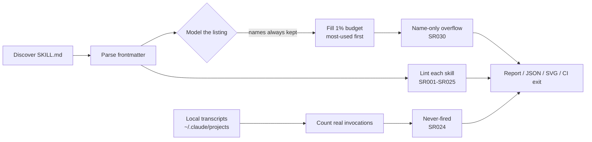

# skillrot

**Every skill you install is a tax on every message you send — whether it fires or not.**

`skillrot` reads your agent's skill library and tells you three things no demo will: what it
actually costs in context, which skills can never fire, and which of them the router has
already stopped seeing because the listing is over budget.

Zero dependencies. One file. Python 3.9+.


<sub>27-second explainer · [MP4](docs/assets/skillrot-explainer.mp4) · [interactive page](docs/demo/explainer.html) · every number in it comes from a real run</sub>

```
$ python skillrot.py ./ECC

skillrot 0.3.0

  Context bill
    292 skills + 94 commands discovered
    2 kept out of context (disable-model-invocation / skillOverrides)
    ~2,027 tokens in the always-on listing  (1.0% of a 200,000-token window)
    ~2,000 tok listing budget (1319% requested)
    over budget by ~24,388 tok: descriptions are being dropped
    ~727,884 tokens of skill bodies waiting to load
    4.7MB on disk

  Heaviest listings  (paid on every message)
      149 tok  /ecc:intent-driven-development
      148 tok  /ecc:flox-environments
      132 tok  /ecc:benchmark-methodology

  0 error(s), 45 warning(s), 375 name-only
```

## The budget nobody sees

Claude Code doesn't put your whole library in context. It keeps every skill **name**, then
fills a budget — **1% of the context window** — with descriptions, dropping the least-used
ones when they don't fit ([docs](https://code.claude.com/docs/en/skills)). A skill listed
name-only has no description in front of the router, so it can't be matched to a request by
keyword. It's installed, it's billed on every message, and it's unroutable.

This repo re-audits popular public libraries every week
([live-audit.yml](.github/workflows/live-audit.yml)). The run on 2026-09-28:

| Library | Skills + commands | Listing vs. budget | Name-only |
| --- | ---: | ---: | ---: |
| [obra/superpowers](https://github.com/obra/superpowers) | 15 + 0 | 0.35× | 0 |
| [addyosmani/agent-skills](https://github.com/addyosmani/agent-skills) | 25 + 9 | 1.3× | 5 |
| [affaan-m/ECC](https://github.com/affaan-m/ECC) | 292 + 94 | 13.2× | 375 |
| [ComposioHQ/awesome-claude-skills](https://github.com/ComposioHQ/awesome-claude-skills) | 864 + 0 | 14.2× | 864 |
| [alirezarezvani/claude-skills](https://github.com/alirezarezvani/claude-skills) | 382 + 104 | 27.4× | 483 |

Even a tidy 25-skill library spills five descriptions at a 200k window, and in ECC the
names alone overflow the budget, so every description is dropped. Full output
in [docs/runs](docs/runs/live-audit-2026-09-28.md). This is not a lab result: a widely-used
library shipped 46 skills at ~3× the budget and Claude Code silently dropped most of them at
session start ([lifeos#1205](https://github.com/danielmiessler/lifeos/issues/1205)).
skillrot is the check that catches it on the PR.

`--svg` draws the same numbers for your own library:


## How it works



Three costs, measured separately because they're different kinds of expensive:

- **Always-on listing.** A skill's name and description sit in context on every request.
  skillrot models the real budget: names always in, descriptions dropped least-used first.
- **Bodies waiting to load.** The body only loads when a skill fires — but then it squats in
  context for the rest of the session. Counted apart from the listing.
- **Real invocations.** skillrot reads your local transcripts (`~/.claude/projects/**/*.jsonl`)
  and counts actual `Skill` tool calls. A skill you've never triggered is charging you rent.
  Nothing leaves your machine.

## Install

```bash
curl -O https://raw.githubusercontent.com/Galactic717/skillrot/main/skillrot.py
python skillrot.py
```

Or:

```bash
pip install git+https://github.com/Galactic717/skillrot
skillrot
```

## Usage

```bash
skillrot                        # audit every skill installed on this machine
skillrot ./skills               # audit a directory (recursively)
skillrot ./skills/x/SKILL.md    # audit one skill
skillrot --portable             # check it will survive a claude.ai / Skills API upload
skillrot --svg budget.svg       # write a shareable budget chart
skillrot --budget-fraction 0.02 # model a raised skillListingBudgetFraction
skillrot --json                 # machine-readable, for scripts and CI
skillrot --fail-on error        # non-zero exit when something is broken
skillrot --full                 # print every finding, not the first 20 per rule
skillrot --no-usage             # skip the transcript scan
skillrot ./repo --all           # count every SKILL.md, ignoring plugin manifests
```

With no path it audits what Claude Code on this machine actually loads:

- personal and project skills (`~/.claude/skills`, and `.claude/skills` from the current
  directory up to the repo root), one level deep, the way the loader reads them — a whole
  repo dropped into `~/.claude/skills/foo/` is one skill at `foo/SKILL.md`;
- legacy command files in `~/.claude/commands` and `.claude/commands` (`frontend/component.md`
  is `/frontend:component`), which share the same listing;
- every plugin enabled in your settings, resolved through the install cache or, for a
  directory marketplace, from its source folder — skills *and* commands;
- your `skillOverrides` (`off` and `user-invocable-only` hide a skill, `name-only` lists
  just the name), `skillListingBudgetFraction` and `SLASH_COMMAND_TOOL_CHAR_BUDGET`.

Skills with `disable-model-invocation: true` are never in the model's context, so they
aren't billed. `~/.codex/skills`, `~/.cursor/skills` and `~/.config/agent-skills` are
audited too if they exist.

Point it at a marketplace or plugin checkout and it reads `.claude-plugin/marketplace.json`
/ `plugin.json`, counting only what Claude Code would install — not translated docs or
mirrors for other harnesses (`docs/ja-JP/skills`, `.gemini/skills`, ...). Any other folder
is scanned recursively.

## Rules

| Rule | Severity | What it catches |
| --- | --- | --- |
| SR001 | error | Frontmatter missing, or not starting on line 1 |
| SR002 | error | No `description` |
| SR003 | error | `description` + `when_to_use` past the 1,536-char per-entry cap |
| SR004 | error | `disable-model-invocation: true` **and** `user-invocable: false` — unreachable |
| SR006 | error | Frontmatter opens but never closes |
| SR007 | error | File cannot be read |
| SR008 | error | Git symlink checked out as a plain text file |
| SR010 | error | Frontmatter field outside the Agent Skills spec (`--portable`) |
| SR011 | warn | `compatibility` over 500 characters (`--portable`) |
| SR005 | warn | Non-boolean value in a boolean field |
| SR020 | warn | Two skills answering to the same command |
| SR021 | warn | Near-identical descriptions competing for the same trigger |
| SR022 | warn | `description` + `when_to_use` say what a skill is, never when to use it |
| SR023 | warn | Oversized body that squats in context once loaded |
| SR025 | warn | Description too thin to route on |
| SR012 | info | Unrecognized frontmatter field |
| SR024 | info | Never invoked in any local transcript |
| SR030 | info | Listed name-only — description dropped from the listing budget |

[docs/RULES.md](docs/RULES.md) has the reasoning and the spec citation behind each one.

## How it's different

The context-cost conversation is full of **audit skills** — prose checklists that run inside
Claude, estimate tokens by word count, and hand back a report that reads differently every
time (ECC's `context-budget`, `gbrain`'s `context-audit`, various `cost-optimizer` skills),
plus the built-in `/skill-doctor`. skillrot is the opposite shape on purpose:

- **Deterministic.** Same library, same numbers, every run. No model in the loop.
- **Any directory, offline.** Audit a marketplace, a PR, or a folder you haven't installed —
  `/skill-doctor` only sees the skills already loaded into a session.
- **CI-gateable.** `--fail-on error` and stable rule ids turn "descriptions silently dropped"
  into a build that fails on the PR, not a surprise at session start.
- **Portability check.** `--portable` catches the non-spec frontmatter that makes a claude.ai
  upload fail outright — before you try to share the skill.

## Token numbers are estimates

No dependencies means no tokenizer. skillrot estimates at 4 characters per token — close
enough to rank offenders and size the budget, not exact. Tune it with `--chars-per-token`,
or pipe `--json` into a real tokenizer for precision. The ranking is what matters. Bundled skills and skills synced from claude.ai are not
on disk, so they are not counted. Exact
accounting also varies between harnesses and versions; skillrot measures the text the spec
says goes into the listing, budgeted the way the docs say it's budgeted.

## Use it in CI

```yaml
- run: python skillrot.py .claude/skills --portable --no-usage --fail-on error
```

Catches the frontmatter mistakes that silently ship a dead skill, and the non-spec fields
that make a `claude.ai` upload fail outright. This repo audits its own skill on every push
across Linux, macOS and Windows, and re-audits five public skill libraries weekly — see
[.github/workflows](.github/workflows).

## Use it as a skill

`SKILL.md` in this repo makes skillrot available to your agent. Drop the repo in
`~/.claude/skills/skillrot/` and ask it to audit your library.

## Contributing

New rules are welcome, with two requirements: a citation for the behaviour it catches, and a
test. Run the suite with:

```bash
python -m unittest discover -s tests
```

## License

MIT
