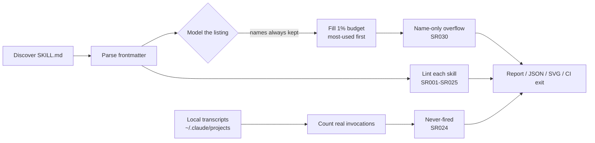

# skillrot

**Every skill you install is a tax on every message you send — whether it fires or not.**

`skillrot` reads your agent's skill library and tells you three things no demo will: what it
actually costs in context, which skills can never fire, and which of them the router has
already stopped seeing because the listing is over budget.

Zero dependencies. One file. Python 3.9+.


<sub>`skillrot ./collection --svg budget.svg` on a 4,642-skill library: the names alone overflow the listing budget, so every description is dropped.</sub>

```
$ skillrot

skillrot 0.2.0

  Context bill
    45 skills discovered
    ~4,713 tokens in the always-on listing  (2.4% of a 200,000-token window)
    ~2,000 tok listing budget (236% requested)
    over budget by ~2,713 tok: descriptions are being dropped
    ~137,728 tokens of skill bodies waiting to load
    3.0MB on disk

  Heaviest listings  (paid on every message)
      231 tok  /project-artifact:project-artifact  never fired
      218 tok  /figma:figma-generate-design        never fired

  0 error(s), 12 warning(s), 9 name-only, 45 skill(s) never fired
```

## The number that isn't cute

Claude Code doesn't put your whole library in context. It keeps every skill **name**, then
fills a budget — **1% of the context window** — with descriptions, dropping the least-used
ones when they don't fit ([docs](https://code.claude.com/docs/en/skills)). A skill listed
name-only has no description in front of the router, so it can't be matched to a request by
keyword. It's installed, it's billed on every message, and it's unroutable.

Point skillrot at one of the 4,000-skill mega-collections people install wholesale and the
budget stops being a suggestion:

```
$ skillrot ./a-4600-skill-collection

    4642 skills discovered
    ~28,420 tokens in the always-on listing  (14.2% of a 200,000-token window)
    ~2,000 tok listing budget (12914% requested)
    over budget by ~256,270 tok: descriptions are being dropped
```

The skill **names alone** are 14× the listing budget, so **every description is dropped**.
This is not hypothetical: a widely-used library shipped 46 skills whose descriptions summed
to ~3× the budget, and Claude Code silently dropped most of them at session start
([lifeos#1205](https://github.com/danielmiessler/lifeos/issues/1205)). skillrot is the check
that catches it before you ship.

## How it works



Three costs, measured separately because they're different kinds of expensive:

- **Always-on listing.** A skill's name and description sit in context on every request.
  skillrot models the real budget: names always in, descriptions dropped least-used first.
- **Bodies waiting to load.** The body only loads when a skill fires — but then it squats in
  context for the rest of the session. Counted apart from the listing.
- **Real invocations.** skillrot reads your local transcripts (`~/.claude/projects/**/*.jsonl`)
  and counts actual `Skill` tool calls. A skill you've never triggered is charging you rent.
  Nothing leaves your machine.

## Install

```bash
curl -O https://raw.githubusercontent.com/Galactic717/skillrot/main/skillrot.py
python skillrot.py
```

Or:

```bash
pip install git+https://github.com/Galactic717/skillrot
skillrot
```

## Usage

```bash
skillrot                        # audit every skill installed on this machine
skillrot ./skills               # audit a directory (recursively)
skillrot ./skills/x/SKILL.md    # audit one skill
skillrot --portable             # check it will survive a claude.ai / Skills API upload
skillrot --svg budget.svg       # write a shareable budget chart
skillrot --budget-fraction 0.02 # model a raised skillListingBudgetFraction
skillrot --json                 # machine-readable, for scripts and CI
skillrot --fail-on error        # non-zero exit when something is broken
skillrot --full                 # print every finding, not the first 20 per rule
skillrot --no-usage             # skip the transcript scan
```

With no path it scans your install locations — `~/.claude/skills`, `~/.claude/plugins`,
`~/.codex/skills`, `~/.cursor/skills`, `~/.config/agent-skills` and `./.claude/skills` —
reading each **skills** directory one level deep, the way the loader does: a whole repo
dropped into `~/.claude/skills/foo/` is one skill at `foo/SKILL.md`, not every nested
`SKILL.md` it happens to contain. To audit a marketplace or a bundled collection, point
skillrot straight at it.

## Rules

| Rule | Severity | What it catches |
| --- | --- | --- |
| SR001 | error | Frontmatter missing, or not starting on line 1 |
| SR002 | error | No `description` |
| SR003 | error | `description` + `when_to_use` past the 1,536-char per-entry cap |
| SR004 | error | `disable-model-invocation: true` **and** `user-invocable: false` — unreachable |
| SR006 | error | Frontmatter opens but never closes |
| SR007 | error | File cannot be read |
| SR008 | error | Git symlink checked out as a plain text file |
| SR010 | error | Frontmatter field outside the Agent Skills spec (`--portable`) |
| SR011 | warn | `compatibility` over 500 characters (`--portable`) |
| SR005 | warn | Non-boolean value in a boolean field |
| SR020 | warn | Two skills answering to the same command |
| SR021 | warn | Near-identical descriptions competing for the same trigger |
| SR022 | warn | `description` + `when_to_use` say what a skill is, never when to use it |
| SR023 | warn | Oversized body that squats in context once loaded |
| SR025 | warn | Description too thin to route on |
| SR012 | info | Unrecognized frontmatter field |
| SR024 | info | Never invoked in any local transcript |
| SR030 | info | Listed name-only — description dropped from the listing budget |

[docs/RULES.md](docs/RULES.md) has the reasoning and the spec citation behind each one.

## How it's different

The context-cost conversation is full of **audit skills** — prose checklists that run inside
Claude, estimate tokens by word count, and hand back a report that reads differently every
time (ECC's `context-budget`, `gbrain`'s `context-audit`, various `cost-optimizer` skills),
plus the built-in `/skill-doctor`. skillrot is the opposite shape on purpose:

- **Deterministic.** Same library, same numbers, every run. No model in the loop.
- **Any directory, offline.** Audit a marketplace, a PR, or a folder you haven't installed —
  `/skill-doctor` only sees the skills already loaded into a session.
- **CI-gateable.** `--fail-on error` and stable rule ids turn "descriptions silently dropped"
  into a build that fails on the PR, not a surprise at session start.
- **Portability check.** `--portable` catches the non-spec frontmatter that makes a claude.ai
  upload fail outright — before you try to share the skill.

## Token numbers are estimates

No dependencies means no tokenizer. skillrot estimates at 4 characters per token — close
enough to rank offenders and size the budget, not exact. Tune it with `--chars-per-token`,
or pipe `--json` into a real tokenizer for precision. The ranking is what matters. Exact
accounting also varies between harnesses and versions; skillrot measures the text the spec
says goes into the listing, budgeted the way the docs say it's budgeted.

## Use it in CI

```yaml
- run: python skillrot.py .claude/skills --portable --no-usage --fail-on error
```

Catches the frontmatter mistakes that silently ship a dead skill, and the non-spec fields
that make a `claude.ai` upload fail outright. This repo audits its own skill on every push
across Linux, macOS and Windows, and re-audits five public skill libraries weekly — see
[.github/workflows](.github/workflows).

## Use it as a skill

`SKILL.md` in this repo makes skillrot available to your agent. Drop the repo in
`~/.claude/skills/skillrot/` and ask it to audit your library.

## Contributing

New rules are welcome, with two requirements: a citation for the behaviour it catches, and a
test. Run the suite with:

```bash
python -m unittest discover -s tests
```

## License

MIT
